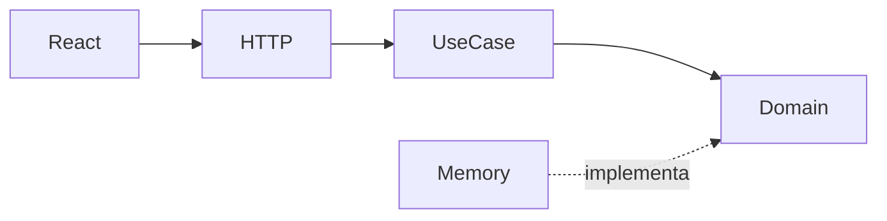

# projeto-go-notas

> Projeto **100% de estudos**. Não é produto, não é SaaS, não está em produção — é o meu laboratório para aprender Go na prática.

Olá! Eu sou o **Lucas Leite** e criei este repositório enquanto estudo **Go** vindo de uma base em .NET. A ideia foi montar algo completo o suficiente para eu entender como um backend real se organiza, mas simples o bastante para eu conseguir explicar cada camada sem me perder.

O resultado é uma API de **notas** (CRUD) com frontend em **React**, separados e conversando via REST.

---

## O que eu queria aprender com isso

- Organizar um projeto Go com pastas que façam sentido (`cmd/`, `internal/`, camadas)
- Entender **DDD** e **Clean Architecture** sem framework mágico — só pacotes e interfaces
- Expor uma API HTTP com `net/http` (stdlib, sem Gin/Echo)
- Conectar um frontend e ver o fluxo completo funcionando
- Publicar no GitHub e ter algo decente para o portfólio

---

## Stack

| Camada | Tecnologia |
|--------|------------|
| Backend | Go 1.22+, `net/http` |
| Frontend | React + TypeScript + Vite |
| Persistência | Memória (por enquanto — some ao reiniciar) |
| Design (front) | Inspirado no [design system Vercel](https://github.com/VoltAgent/awesome-design-md/blob/main/design-md/vercel/DESIGN.md) |

---

## Como o projeto está organizado

Eu separei as responsabilidades assim:

```
projeto-go-notas/
├── cmd/api/                    # ponto de entrada — onde tudo se conecta
├── internal/
│   ├── domain/note/            # entidade, regras, interface do repositório
│   ├── usecase/note/           # casos de uso (criar, listar, editar, excluir)
│   ├── infrastructure/memory/  # "banco" em memória
│   └── interfaces/http/        # handlers REST + CORS
├── frontend/                   # React consumindo a API
└── go.mod
```

### O que cada camada faz (na minha cabeça)

| Camada | Papel |
|--------|-------|
| **domain** | O coração — entidade `Note`, validações, erros de negócio |
| **usecase** | Orquestra o fluxo — não sabe de HTTP nem de onde os dados vêm |
| **infrastructure** | Detalhe técnico — hoje é memória, amanhã pode ser Postgres |
| **interfaces** | Porta de entrada — traduz HTTP em chamadas de caso de uso |

A regra que eu tento seguir: **dependências apontam para dentro**. O domínio não importa HTTP nem banco.



---

## Rodar localmente

### Pré-requisitos

- [Go](https://go.dev/dl/) instalado (`go version`)
- [Node.js](https://nodejs.org/) instalado (`node --version`)

### 1. Backend (Go)

```powershell
cd "C:\Users\Lucas M2Z Creative\Documents\estudos-golang"
go run ./cmd/api
```

API em **http://localhost:8080**

### 2. Frontend (React)

Em outro terminal:

```powershell
cd "C:\Users\Lucas M2Z Creative\Documents\estudos-golang\frontend"
npm install
npm run dev
```

Abra **http://localhost:5173**

---

## Endpoints da API

| Método | Rota | Descrição |
|--------|------|-----------|
| `GET` | `/health` | Health check |
| `GET` | `/api/notes` | Listar notas |
| `POST` | `/api/notes` | Criar nota |
| `GET` | `/api/notes/{id}` | Buscar por ID |
| `PUT` | `/api/notes/{id}` | Atualizar |
| `DELETE` | `/api/notes/{id}` | Excluir |

**Exemplo — criar nota:**

```json
POST /api/notes
{
  "title": "Estudar interfaces em Go",
  "content": "Repository é um port, memory é um adapter"
}
```

---

## O que eu já fiz / o que vem depois

**Feito:**
- [x] API REST com Clean Architecture
- [x] CRUD de notas
- [x] Frontend React integrado
- [x] CORS para desenvolvimento local
- [x] Design system Vercel no front

**Próximos estudos (quando eu for evoluindo):**
- [ ] Persistência com Postgres
- [ ] Testes nos use cases
- [ ] Autenticação básica
- [ ] Docker para subir tudo junto

---

## Observações honestas

- Os dados ficam **só em memória** — se reiniciar o servidor, as notas somem
- O CORS está aberto (`*`) só para facilitar o estudo local
- Eu ainda estou aprendendo Go — este código reflete meu nível **atual**, não um padrão definitivo de mercado
- Feedback é bem-vindo!

---

## Autor

**Lucas Leite** — [olucasleitedev](https://github.com/olucasleitedev)

Projeto de estudos pessoal. Sinta-se à vontade para explorar o código, forkar ou usar como referência.
