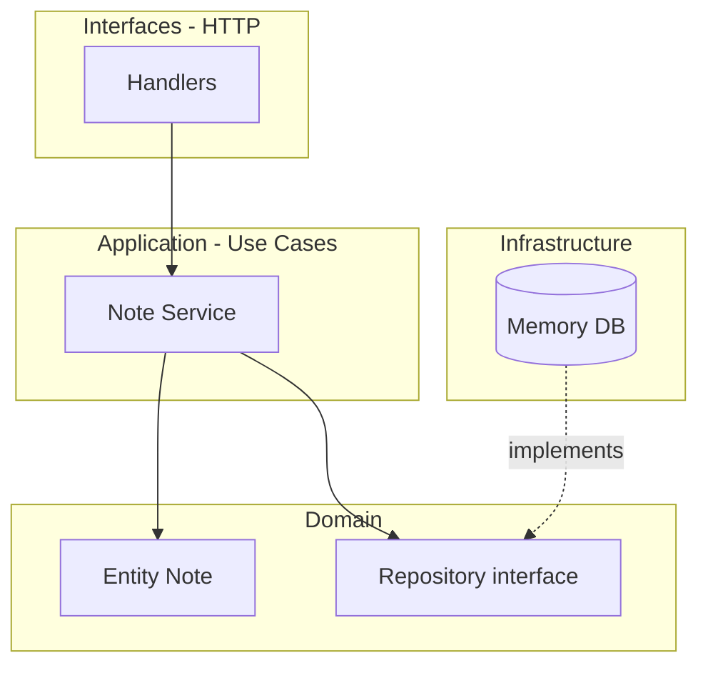

# projeto-go-notas

Notes API — Backend Go (DDD + Clean Architecture) com frontend React.

API REST de notas, pronta para integrar com frontend (React, Vue, etc.).

## Go pode usar DDD e Clean Architecture?

**Sim.** Go não tem frameworks oficiais para isso — você organiza **pacotes e interfaces**. A comunidade usa bastante:

| Conceito | Onde fica neste projeto |
|----------|-------------------------|
| **DDD — Entidade** | `internal/domain/note/entity.go` |
| **DDD — Regras de negócio** | métodos da entidade (`New`, `Update`) |
| **DDD — Repositório (port)** | `internal/domain/note/repository.go` |
| **Clean — Use Case** | `internal/usecase/note/service.go` |
| **Clean — Adapter (saída)** | `internal/infrastructure/memory/` |
| **Clean — Adapter (entrada)** | `internal/interfaces/http/` |
| **Composition Root** | `cmd/api/main.go` |

### Regra de dependência (Clean Architecture)

**Dependências apontam para dentro** — o domínio não importa HTTP nem banco.



## Estrutura de pastas

```
estudos-golang/
├── cmd/
│   └── api/
│       └── main.go                 # entrada + injeção de dependências
├── frontend/                       # React + Vite (consome a API)
├── internal/
│   ├── domain/note/                # núcleo: entidades, erros, ports
│   ├── usecase/note/               # casos de uso (aplicação)
│   ├── infrastructure/memory/      # persistência em memória
│   └── interfaces/http/            # REST + CORS para o frontend
├── go.mod
└── README.md
```

### Por que `internal/`?

Pacotes dentro de `internal/` **só podem ser importados por este módulo**. Evita que outros projetos dependam do seu código interno por acidente.

### Por que `cmd/api/`?

Convenção Go: cada executável fica em `cmd/<nome>/main.go`. Amanhã você pode ter `cmd/migrate/`, `cmd/worker/`, etc.

## Rodar (full stack)

**Terminal 1 — Backend Go:**

```powershell
cd $env:USERPROFILE\Documents\estudos-golang
go run ./cmd/api
```

API em `http://localhost:8080`

**Terminal 2 — Frontend React:**

```powershell
cd $env:USERPROFILE\Documents\estudos-golang\frontend
npm install
npm run dev
```

Abra `http://localhost:5173` — o React consome `/api/notes` via `fetch`.

## Endpoints (para o frontend)

| Método | Rota | Body JSON |
|--------|------|-----------|
| `GET` | `/health` | — |
| `GET` | `/api/notes` | — |
| `POST` | `/api/notes` | `{"title":"...","content":"..."}` |
| `GET` | `/api/notes/{id}` | — |
| `PUT` | `/api/notes/{id}` | `{"title":"...","content":"..."}` |
| `DELETE` | `/api/notes/{id}` | — |

CORS já habilitado (`*`) para desenvolvimento local.

### Exemplo no frontend (fetch)

```javascript
const API = "http://localhost:8080";

// listar
const notes = await fetch(`${API}/api/notes`).then(r => r.json());

// criar
await fetch(`${API}/api/notes`, {
  method: "POST",
  headers: { "Content-Type": "application/json" },
  body: JSON.stringify({ title: "Minha nota", content: "Texto" }),
});
```

## Próximos passos do projeto

1. **Postgres** — nova implementação em `infrastructure/postgres/` (mesma interface `Repository`)
2. **Autenticação** — novo bounded context `domain/user/`
3. **Validação** — DTOs na camada HTTP separados da entidade
4. **Testes** — `usecase` e `domain` sem precisar de HTTP

## Como pensar ao adicionar features

1. Modela a **entidade** e regras em `domain/`
2. Define o **port** (interface do repositório) no domínio
3. Escreve o **caso de uso** em `usecase/`
4. Implementa o **adapter** em `infrastructure/`
5. Expõe via **handler HTTP** em `interfaces/http/`
6. **Liga tudo** só no `cmd/api/main.go`
